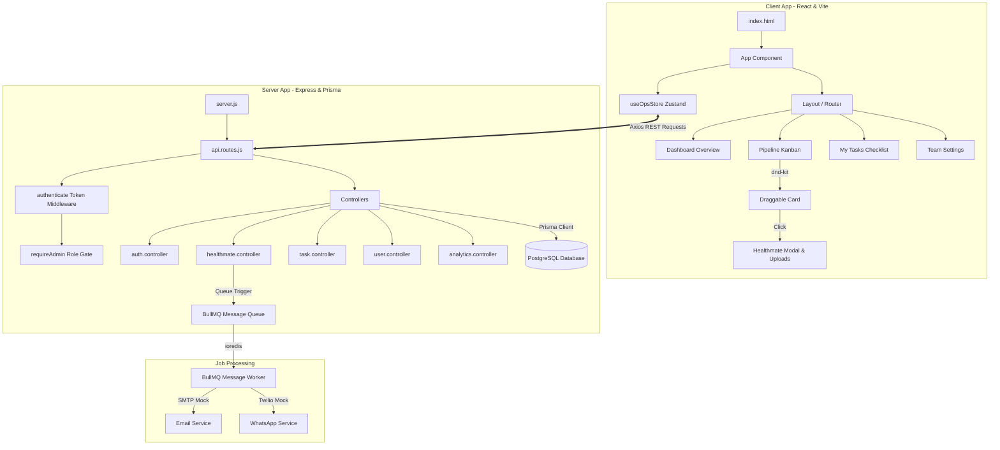

# Lifed Healthmate Onboarding Manager — Learning Guide

> A complete walkthrough of everything built, why each decision was made,
> and the concepts behind every technology used.

---

## Table of Contents

1. [Project Overview](#1-project-overview)
2. [Tech Stack — The Why](#2-tech-stack--the-why)
3. [System Architecture](#3-system-architecture)
4. [Database Design & Schema](#4-database-design--schema)
5. [Backend — Structure & Workflow](#5-backend--structure--workflow)
6. [Authentication — Security Guardrails](#6-authentication--security-guardrails)
7. [Prisma ORM — Database Operations](#7-prisma-orm--database-operations)
8. [Frontend — Structure & Architecture](#8-frontend--structure--architecture)
9. [State Management — Zustand Action Flow](#9-state-management--zustand-action-flow)
10. [Drag and Drop — dnd-kit Operations](#10-drag-and-drop--dnd-kit-operations)
11. [Background Jobs — BullMQ & Redis Queue](#11-background-jobs--bullmq--redis-queue)
12. [Design Aesthetics & Typography](#12-design-aesthetics--typography)
13. [Data Flow — End-to-End Lifecycle](#13-data-flow--end-to-end-lifecycle)
14. [Key Concepts Glossary](#14-key-concepts-glossary)

---

## 1. Project Overview

**What we built:** A multi-user, responsive CRM and operations dashboard called the **"Lifed Healthmate Onboarding Manager"**. It enables an operations team to efficiently track, manage, and communicate with health partners (referred to as **Healthmates**) as they progress through a 5-stage onboarding pipeline.

**The problem it solves:** Traditional operations teams track partner onboarding in rigid, offline spreadsheets. This manual method results in partners getting stuck in pipeline phases, follow-up communications being missed, and a lack of clarity regarding owner assignments. 

This platform resolves these pain points by offering:
* **Interactive Kanban Board**: Visualizes the workflow, allowing agents to drag-and-drop partner cards between columns.
* **Stage-Specific Checklists**: Tracks pending onboarding steps for each partner in their current phase.
* **Aggregated Ops Tasks**: A unified panel where agents can check off all outstanding tasks across the database.
* **One-Click Communication Triggers**: Directly queues context-aware emails and WhatsApp follow-ups in the background.

```
THE 5 PIPELINE PHASES:
┌──────────────┐    ┌─────────┐    ┌──────────┐    ┌────────┐    ┌──────┐
│ PRE_QUALIFY  │───>│ PREPARE │───>│ REGISTER │───>│ REVIEW │───>│ LIVE │
└──────────────┘    └─────────┘    └──────────┘    └────────┘    └──────┘
```

---

## 2. Tech Stack — The Why

### Backend
| Technology | Why we chose it |
|---|---|
| **Node.js** | Provides an asynchronous, event-driven JavaScript runtime on the server, ensuring excellent scalability. |
| **Express.js** | A minimal, fast, and unopinionated framework for handling routes, HTTP methods, and custom middleware. |
| **PostgreSQL** | A powerful object-relational database engine selected for data persistence with strict schemas and foreign key relations. |
| **Prisma ORM** | A modern database toolkit. It automatically creates type-safe typescript client libraries and handles migrations seamlessly. |
| **bcryptjs** | Used for irreversible one-way password hashing before databases saving, protecting credentials against leaks. |
| **jsonwebtoken** | Implements stateless JWT authentication, passing cryptographic proof of identities on requests. |
| **BullMQ + ioredis** | Background queue layer. Prevents blocking Express request loops by executing messaging processes in background worker threads. |

### Frontend
| Technology | Why we chose it |
|---|---|
| **React** | Component-driven model for high-efficiency updates. Re-renders UI elements cleanly as state changes. |
| **Vite** | Blazing fast build tool using native ES Modules to support rapid Hot Module Replacement (HMR) during development. |
| **Tailwind CSS** | Utility-first styling framework enabling custom components to be styled rapidly without writing disjointed stylesheets. |
| **Zustand** | Minimalist global store. Provides reactive hooks to state modifications without complex boilerplate code or deep context wrapping. |
| **Axios** | Standard HTTP client featuring request interceptors to automatically bind JWT tokens to `Authorization` headers. |
| **dnd-kit** | Lightweight, accessible drag-and-drop library configured with custom React hooks to perform smooth canvas translations. |
| **react-hot-toast** | Renders elegant, custom visual toast banners for backend confirmations and error alerts. |
| **lucide-react** | Clean icon assets served directly as inline SVG React components. |

---

## 3. System Architecture

Below is the layout of the modular relationship between our Client-Side and Server-Side platforms:



---

## 4. Database Design & Schema

We use **Prisma ORM** coupled with a PostgreSQL database. Below are the key tables and structural models defined in `backend/prisma/schema.prisma`:

### Model Diagrams

```
  ┌───────────────┐               ┌───────────────┐               ┌───────────┐
  │    OpsUser    │               │  Healthmate   │               │   Task    │
  ├───────────────┤               ├───────────────┤               ├───────────┤
  │ id (PK)       │               │ id (PK)       │               │ id (PK)   │
  │ email (Unique)│ 1           * │ name          │ 1           * │ title     │
  │ passwordHash  │──────────────>│ type (Enum)   │──────────────>│ completed │
  │ name          │               │ category      │               │ phase     │
  │ role          │               │ phase (Enum)  │               │ due       │
  └───────────────┘               │ opsUserId (FK)│               └───────────┘
                                  └───────────────┘
```

### Models Breakdown

1. **`OpsUser` (Operations & Administrative Staff)**
   * Manages dashboard user accounts.
   * `id`: Unique UUID.
   * `email`: Standardized user email address (unique constraints).
   * `passwordHash`: Crytographically secure hashed password string.
   * `role`: String determining authority levels (defaults to `'ops'`, elevated via `'admin'`).
   * **Relation**: One `OpsUser` can own/manage multiple `Healthmate` partner accounts.

2. **`Healthmate` (Onboarding Partners)**
   * Repesents a specific healthcare practitioner or clinic in the onboarding process.
   * `type`: Enum supporting `PRACTITIONER`, `CENTRE`, and `ORGANIZER`.
   * `phase`: Enum representing their current location in the onboarding pipeline (`PRE_QUALIFY`, `PREPARE`, `REGISTER`, `REVIEW`, `LIVE`).
   * `daysInPhase`: Counter tracking how many days a partner has spent in their active phase.
   * `regDocUrl` / `regDocName`: File upload pointers storing PDF/Image routes for verified regulatory documents.
   * **Relation**: Belongs to a single `OpsUser` coordinator. Cascade rules ensure that if a team member is deleted, their managed `Healthmate` partners are automatically reassigned to the active administrator to prevent orphaned listings.

3. **`Task` (Action Items)**
   * Tracks discrete steps required to complete onboarding.
   * `phase`: Specifies which stage of the pipeline the task belongs to.
   * `completed`: Boolean tracking current status.
   * **Relation**: Cascade deletion rules link each task directly to its parent `Healthmate`. If a `Healthmate` is removed, all associated checklist items are deleted immediately.

---

## 5. Backend — Structure & Workflow

The backend server is built modularly. Below is the directory map:

```
backend/
├── prisma/
│   ├── schema.prisma          # Database schema structure
│   └── migrations/            # SQL migration scripts logs
├── src/
│   ├── controllers/           # API request processors
│   │   ├── analytics.controller.js
│   │   ├── auth.controller.js
│   │   ├── healthmate.controller.js
│   │   ├── task.controller.js
│   │   └── user.controller.js
│   ├── middleware/            # JWT verification & upload rules
│   │   ├── auth.middleware.js
│   │   └── upload.js
│   ├── routes/                # Endpoint controllers router
│   │   └── api.routes.js
│   ├── services/              # Third-party integrations
│   │   ├── email.service.js
│   │   ├── queue.service.js
│   │   └── whatsapp.service.js
│   ├── utils/
│   │   └── template.engine.js
│   └── workers/               # Background task queue processors
│       └── message.worker.js
├── .env                       # Environment credentials
├── server.js                  # Express entry point
└── package.json
```

### Express Server Entry Point (`server.js`)
* Boots the Express application, configures CORS, and registers static directories (e.g., `uploads/` for documents).
* Automatically initialises the **BullMQ Message Worker** in a resilient `try/catch` wrapper. If Redis is unavailable, the main REST API remains active, degrading background queues gracefully.

### Routing Layer (`api.routes.js`)
Endpoints are classified as Public or Protected (requiring JWT verification):
* **Public**: `/auth/register`, `/auth/login`
* **Protected** (via `authenticate` middleware):
  * **Analytics**: `GET /analytics/summary`
  * **Healthmates**: `GET /healthmates`, `POST /healthmates`, `PATCH /healthmates/:id/phase`, `DELETE /healthmates/:id`
  * **Tasks**: `POST /healthmates/:id/tasks`, `PATCH /tasks/:taskId/toggle`, `GET /tasks/pending`
  * **Messaging**: `POST /healthmates/:id/messages`
* **Admin Locked** (via `authenticate` + `requireAdmin` middleware):
  * `GET /users` - Retrieve team members list.
  * `POST /users` - Create and invite new users.
  * `DELETE /users/:id` - Delete user with partner reassignment safety constraints.

---

## 6. Authentication — Security Guardrails

The application utilizes state-of-the-art authentication guardrails:

```
              INCOMING REQUEST WITH HEADERS:
              Authorization: Bearer <JWT_TOKEN>
                             │
                             ▼
               [authMiddleware.authenticate]
                             │
            Is token present, signed & valid?
               ├── No  ──> [401 Unauthorized]
               └── Yes ──> Decodes payload to req.user
                             │
                             ▼
               [authMiddleware.requireAdmin]
                             │
                 Is req.user.role === 'admin'?
               ├── No  ──> [403 Forbidden]
               └── Yes ──> Passes to Router Controller
```

### Security Details
* **Cryptographic Hashing**: `bcryptjs` is configured with a salt round factor of `12`. Standard passwords are never stored in raw text.
* **Signed Tokens**: JWTs encapsulate user credentials (`id`, `email`, `role`) signed by the server's private `JWT_SECRET`. Tokens carry strict expiration dates.
* **Self-Deletion Guard**: When deleting a user, the controller checks `req.user.id === id`. It prevents administrators from accidentally deleting their own active profile, which would cause an lock-out.
* **Partner Reassignment Guard**: To prevent orphaned records, deleting a team member triggers an automatic update query:
  ```javascript
  await prisma.healthmate.updateMany({
    where: { opsUserId: targetId },
    data: { opsUserId: executingAdminId },
  });
  ```

---

## 7. Prisma ORM — Database Operations

**Prisma** abstracts standard SQL into a programmatic API. Key database queries used in our controllers include:

* **Transactional Task Check**:
  ```javascript
  const pendingTasks = await prisma.task.findMany({
    where: { completed: false },
    include: { healthmate: { select: { name: true, type: true, phase: true } } }
  });
  ```
* **Metrics Aggregation**: Uses relational counts to return pipeline numbers in a single query:
  ```javascript
  const counts = await prisma.healthmate.groupBy({
    by: ['phase'],
    _count: true
  });
  ```

---

## 8. Frontend — Structure & Architecture

The frontend is structured as a single-page application built on Vite, React, and Zustand:

```
frontend/
├── public/                    # Static assets
│   └── favicon.svg            # Custom clover icon
├── src/
│   ├── assets/
│   │   └── favicon.svg        # Scalable source logo
│   ├── components/            # Isolated UI blocks
│   │   ├── dashboard/         # Statistics and Team Panels
│   │   │   ├── DashboardOverview.jsx
│   │   │   ├── MyTasks.jsx
│   │   │   └── TeamManagement.jsx
│   │   ├── pipeline/          # Kanban Columns & Checklists
│   │   │   ├── HealthmateModal.jsx
│   │   │   ├── PipelineBoard.jsx
│   │   │   ├── PipelineColumn.jsx
│   │   │   └── PartnerCard.jsx
│   │   ├── Layout.jsx         # Sidebar navigation wrapper
│   │   └── Login.jsx          # Login gate interface
│   ├── lib/
│   │   └── axios.js           # API HTTP interceptor rules
│   ├── store/
│   │   └── useOpsStore.js     # Zustand state store
│   ├── App.jsx                # Router & entry component
│   ├── index.css              # Custom styling tokens
│   └── main.jsx               # React DOM root mounting
├── index.html                 # App container
└── vite.config.js
```

### Navigation & Routing
We implement a lightweight, fast state-based routing system inside [App.jsx](file:///e:/lifed-1kiro%20-%20Copy/frontend/src/App.jsx):
```javascript
const PAGES = {
  dashboard: <DashboardOverview />,
  pipeline:  <PipelineBoard />,
  tasks:     <MyTasks />,
  team:      <TeamManagement />,
};
```
React dynamically swaps active views without the overhead of browser page reloads.

---

## 9. State Management — Zustand Action Flow

State management is centralized inside [useOpsStore.js](file:///e:/lifed-1kiro%20-%20Copy/frontend/src/store/useOpsStore.js):

```
       [USER ACTION: Drag Card / Toggle Checkbox]
                           │
                           ▼
              [Zustand Action Dispatched]
           (e.g., store.updateHealthmatePhase)
                           │
             ┌─────────────┴─────────────┐
             ▼                           ▼
    [Optimistic UI Update]    [Axios Async API Request]
    (Immediate visual change) (Updates database in background)
                                         │
                                ┌────────┴────────┐
                                ▼                 ▼
                           [API Success]     [API Error]
                            (Keep state)    (Revert state +
                                            toast notification)
```

### Custom Interceptor Configuration
Axios uses a custom token builder to inject JWT credentials into every outgoing request automatically:
```javascript
api.interceptors.request.use((config) => {
  const token = localStorage.getItem('token');
  if (token) {
    config.headers.Authorization = `Bearer ${token}`;
  }
  return config;
});
```

---

## 10. Drag and Drop — dnd-kit Operations

We use **dnd-kit** to implement an interactive Kanban board with three main concepts:

1. **`DndContext`**: Encompasses the entire drag-and-drop board, capturing active coordinates and firing events when cards are lifted or released.
2. **`useDraggable`**: Binds to the partner card component, providing references and visual offset coordinates to translate elements smoothly during movement.
3. **`useDroppable`**: Binds to columns. It identifies whether a dragged card is hovering over a column's drop zone.

```javascript
// Inside PipelineBoard.jsx
const handleDragEnd = async (event) => {
  const { active, over } = event;
  if (!over) return;

  const cardId = active.id;
  const newPhase = over.id; // Target column phase (e.g. "PREPARE")

  // Fire optimistic update to ensure smooth transitions
  await updateHealthmatePhase(cardId, newPhase);
};
```

---

## 11. Background Jobs — BullMQ & Redis Queue

To prevent long-running tasks (like email or SMS generation) from blocking client requests, the platform uses a background processing model powered by **BullMQ** and **Redis**:

```
 [Express Endpoint] ────> [queue.service] ────> [Redis Queue]
                                                     │
                                                     ▼
 [API Response] <─── [200 OK: Job Queued]        [message.worker.js]
 (Immediate Client Success)                         │
                                                    ▼
                                            [Job Processed]
                                       (Hydrates templates and
                                        sends email/WhatsApp)
```

### Resiliency & Error Handling
* **Redis Connection Error Filtering**: If Redis is offline, ioredis normally logs repeated connection failure notices that can flood the console and starve the single-threaded Node.js event loop. We resolved this by adding a custom error listener in `message.worker.js` that suppresses connection-retry warnings while maintaining active retry loops in the background:
  ```javascript
  worker.on('error', (err) => {
    const msg = err?.message || '';
    if (msg.includes('ECONNREFUSED')) return; // Silently retry
    console.error('[Worker] Error:', msg);
  });
  ```
  This keeps the server responsive even when Redis is offline.

---

## 12. Design Aesthetics & Typography

The Onboarding Manager is styled using a dark, modern palette based on the **Roboto** typography system:

* **Font Settings**:
  * Loaded via Google Fonts: `Roboto` (weights: `400` Regular, `500` Medium, `700` Bold).
  * Configured in the Tailwind theme as the default sans-serif font family.
  * System font-weight defaults to `400` for a clean, highly readable interface.
* **Palette Specifications**:
  * **Brand Colors**: Sleek teal (`#00ad9c`) and fresh green (`#5fba46`).
  * **Sidebar**: Deep forest green (`#112421`) for a premium look.
  * **Main Background**: Off-white mint (`#f8fcf9`) to provide high visual contrast.

---

## 13. Data Flow — End-to-End Lifecycle

Here is the step-by-step lifecycle of a partner moving through the onboarding platform:

1. **Invitation**: An admin adds a new team member. A hashed password is created, and the user is saved to PostgreSQL.
2. **Creation**: An ops agent logs in, opens the modal, and creates a `Healthmate` profile (which defaults to the `PRE_QUALIFY` phase).
3. **Task Checklist**: When the card is opened, stage-specific tasks are rendered. Agents toggle checkboxes to update task status in real time.
4. **Document Upload**: During the `REGISTER` phase, a verified PDF/Image document is uploaded to the Express backend via `multer`.
5. **Stage Progression**: The agent drags the card from `REGISTER` to `REVIEW`. This updates the database, resets `daysInPhase` to `0`, and triggers a confirmation toast.
6. **Communication**: Clicking the email button queues a task in BullMQ. The background worker hydrates the stage-specific template and sends the email without blocking the UI.
7. **Deletion Safety**: If an admin deletes a team member, the database cascades and automatically transfers all active partners to the active admin.

---

## 14. Key Concepts Glossary

* **JWT (JSON Web Token)**: A compact, URL-safe container used to securely transmit cryptographically signed data between the client and server.
* **ORM (Object-Relational Mapping)**: A programming technique for converting data between relational databases and object-oriented code, eliminating the need to write raw SQL queries.
* **BullMQ**: A robust Node.js queue library backed by Redis, designed to process asynchronous background jobs.
* **HMR (Hot Module Replacement)**: A development feature that updates application modules in the browser in real time without requiring a full page refresh.
* **CORS (Cross-Origin Resource Sharing)**: A browser security mechanism that restricts HTTP requests made to a different domain than the one serving the web app.
* **Prisma Migrations**: Programmatic records of database schema changes, tracking schema history directly inside the SQL database.
