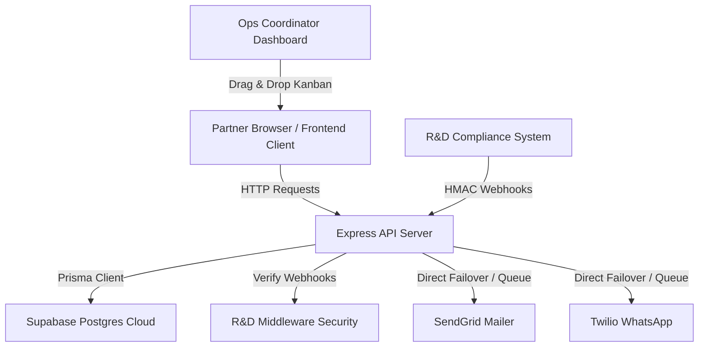

# Lifed Healthmate Onboarding System - Technical Overview

This document provides a comprehensive overview of the **Lifed Healthmate Onboarding Manager** platform, summarizing what was built, the technology stack, and the operational features designed for the Operations and R&D compliance teams.

---

## 1. System Architecture Diagram

---

## 2. Technology Stack

The platform is designed around a three-tier cloud architecture separating user presentation, API servers, and data persistence:

### Frontend (Client Interface)
* **React & Vite:** Fast client-side rendering engine with hot module replacement.
* **TailwindCSS:** Modern CSS framework utilizing variables and smooth animations.
* **Zustand:** Ultra-lightweight and high-performance central state management.
* **dnd-kit:** Responsive, accessible drag-and-drop primitives mapping card movements.

### Backend (Server API)
* **Node.js & Express:** Scalable event-driven web framework handling API routing and middleware.
* **Prisma ORM:** Database client generating strictly typed queries and automatic migrations.
* **BullMQ & Redis:** Background queue processors managing scheduled jobs and notifications.

### Database & Hosting (Cloud Infrastructure)
* **Supabase Cloud (PostgreSQL):** PostgreSQL instance managing relations, checks, and cascade triggers.
* **Supavisor (Supabase Connection Pooler):** High-throughput connection manager handling transaction and session queries.
* **Cloudflare Workers/Pages:** Distributed edge network hosting the static frontend assets.
* **Render Web Services:** Cloud app runner hosting the containerized Node.js backend.

---

## 3. Core Features & Capabilities

The platform automates the entire onboarding lifecycle of healthcare partners (Healthmates) and secures communication with the R&D compliance systems:

### 📋 Interactive Kanban Pipeline
* Visualizes partners across 5 onboarding phases: `PRE_QUALIFY` ➔ `PREPARE` ➔ `REGISTER` ➔ `REVIEW` ➔ `LIVE`.
* Track and update partner statuses, contacts, and uploaded registry documents.
* Stage transitions reset stage timers (`daysInPhase`) and notify operations agents.

### 🔒 Webhook Integration with R&D
Exposes 4 public endpoints to automate compliance transitions:
1. `POST /api/webhooks/registration-submitted`: Moves partner to `REGISTER` phase and seeds task checklists.
2. `POST /api/webhooks/verification-completed`: Triggers automated credential delivery.
3. `POST /api/webhooks/program-submitted`: Transitions record to `REVIEW` phase upon program submission.
4. `POST /api/webhooks/program-status`: Approves or flags program for corrections with review remarks.

### 🛡️ HMAC-SHA256 Webhook Security
* Every webhook request is signed with an `X-RD-Signature` header computed using the request body and a shared secret (`RD_WEBHOOK_SECRET`).
* Custom middleware validates signatures using `crypto.timingSafeEqual` to safeguard database endpoints against timing attacks and spoofing.

### ✉️ Resilient Credential Provisioning Service
* Automatically generates secure, randomized login credentials for new partners.
* Delivers templates via **Email (SendGrid)** and **WhatsApp (Twilio)**.
* **Redis Failover Fallback:** If the Redis queue server goes offline, the backend automatically detects it and falls back to dispatching notifications directly, ensuring webhooks succeed without stalling.

---

## 4. Deployed Infrastructure Mappings

| Service Component | Deployed URL | Hosting Provider |
| :--- | :--- | :--- |
| **Frontend UI** | [https://onboarding.pixellon.in](https://onboarding.pixellon.in) (or [onboardingdesk.workers.dev](https://onboardingdesk.aayushraj1601.workers.dev)) | Cloudflare Pages |
| **Backend Express Server** | [https://onboardingdesk.onrender.com](https://onboardingdesk.onrender.com) | Render |
| **PostgreSQL Database** | `ihwvwjgamlskaehiofel` at Sydney region | Supabase |
