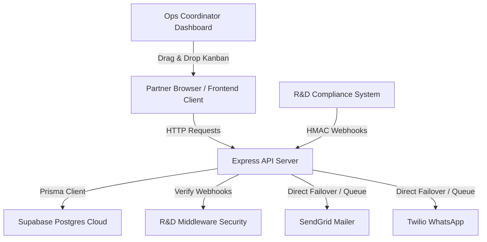

# Lifed Healthmate Onboarding System - Technical Overview

This document provides a comprehensive overview of the **Lifed Healthmate Onboarding Manager** platform, summarizing what was built, the technology stack, and the operational features designed for the Operations and R&D compliance teams.

---

## 1. System Architecture Diagram

```mermaid
graph TD
    A[Partner Browser / Frontend Client] -->|HTTP Requests| B[Express API Server]
    B -->|Prisma Client| C[Supabase Postgres Cloud]
    B -->|Verify Webhooks| D[R&D Middleware Security]
    E[R&D Compliance System] -->|HMAC Webhooks| B
    B -->|Direct Failover / Queue| F[SendGrid Mailer]
    B -->|Direct Failover / Queue| G[Twilio WhatsApp]
    H[Ops Coordinator Dashboard] -->|Drag & Drop Kanban| A
```

---

## 2. Technology Stack

The platform is designed around a three-tier cloud architecture separating user presentation, API servers, and data persistence:

### Frontend (Client Interface)
* **React & Vite:** Fast client-side rendering engine with hot module replacement.
* **TailwindCSS / Vanilla CSS:** Modern styling utilizing fluid custom properties, HSL colors, and smooth animations.
* **Zustand:** Ultra-lightweight and high-performance central state management.
* **dnd-kit:** Responsive, accessible drag-and-drop primitives mapping card movements.

### Backend (Server API)
* **Node.js & Express:** Scalable event-driven web framework handling API routing and middleware.
* **Prisma ORM:** Database client generating strictly typed queries and automatic migrations.
* **BullMQ & Redis:** Background queue processors managing scheduled jobs and notifications.

### Database & Hosting (Cloud Infrastructure)
* **Supabase Cloud (PostgreSQL):** PostgreSQL instance managing relations, checks, and cascade triggers for partner onboarding.
* **Supavisor (Supabase Connection Pooler):** High-throughput connection manager handling transaction and session queries.
* **Local JSON Flat-File Storage:** A segregated JSON database (`backend/src/data/service_users.json`) hosting end-user details (service users), keeping user data strictly isolated from partner compliance data.
* **Cloudflare Workers/Pages:** Distributed edge network hosting the static frontend assets.
* **Render Web Services:** Cloud app runner hosting the containerized Node.js backend.

---

## 3. Core Features & Capabilities

The platform automates the onboarding lifecycle of healthcare partners (Healthmates), isolates and tracks client database metrics (Service Users), and secures communication with R&D compliance:

### 📋 Interactive Kanban Pipeline
* Visualizes partners across 5 onboarding phases: `PRE_QUALIFY` ➔ `PREPARE` ➔ `REGISTER` ➔ `REVIEW` ➔ `LIVE`.
* Track and update partner statuses, contacts, and uploaded registry documents.
* Stage transitions reset stage timers (`daysInPhase`) and notify operations agents.

### 👥 Dedicated Service Users CRM
* A separate, dedicated workspace for operations teams to manage end users (clients) independently from Healthmate partners.
* Monitors user records containing contact detail indices, membership tier badges (`Silver`, `Gold`, `Platinum`), status indicators (`ACTIVE`, `INACTIVE`, `SUSPENDED`), and notes.
* Contextual tabs for tracking **Bookings**, **Payments** (in Indian Rupee `₹` currency notation), and **Support Tickets**.
* Promotion utility transforming inbound `SERVICE_USER` type enquiries into live service user accounts via a custom confirmation modal.

### 🔒 Webhook Integration with R&D
Exposes 4 public endpoints to automate compliance transitions:
1. `POST /api/webhooks/registration-submitted`: Moves partner to `REGISTER` phase and seeds task checklists.
2. `POST /api/webhooks/verification-completed`: Triggers automated credential delivery.
3. `POST /api/webhooks/program-submitted`: Transitions record to `REVIEW` phase upon program submission.
4. `POST /api/webhooks/program-status`: Approves or flags program for corrections with review remarks.

### 🛡️ HMAC-SHA256 Webhook Security
* Every webhook request is signed with an `X-RD-Signature` header computed using the request body and a shared secret (`RD_WEBHOOK_SECRET`).
* Custom middleware validates signatures using `crypto.timingSafeEqual` to safeguard database endpoints against timing attacks and spoofing.

### ✉️ Resilient Credential Provisioning Service
* Automatically generates secure, randomized login credentials for new partners.
* Delivers templates via **Email (SendGrid)** and **WhatsApp (Twilio)**.
* **Redis Failover Fallback:** If the Redis queue server goes offline, the backend automatically detects it and falls back to dispatching notifications directly, ensuring webhooks succeed without stalling.

---

## 4. Deployed Infrastructure Mappings

| Service Component | Deployed URL | Hosting Provider |
| :--- | :--- | :--- |
| **Frontend UI** | [https://operations.lifedhealth.com/](https://operations.lifedhealth.com/) | Cloudflare Pages |
| **Backend Express Server** | [https://onboardingdesk.onrender.com](https://onboardingdesk.onrender.com) | Render |
| **PostgreSQL Database** | `[REDACTED]` at Sydney region | Supabase |

---

## 5. Security & Compliance Status

* **Environment Variables:** ✅ **Implemented.** `dotenv` securely injects configuration (`PORT`, `CLIENT_ORIGIN`, database URIs, JWT secrets) across the backend without hardcoding.
* **Rate Limiting:** ✅ **Implemented.** API routes are protected using `express-rate-limit` to mitigate brute-force and DDoS attacks.
* **CORS Configuration:** ✅ **Implemented.** A strict CORS policy is enforced in the Express server, restricting access solely to authorized origins (`process.env.CLIENT_ORIGIN`, local development ports, and Cloudflare workers).
* **Privacy Compliance (GDPR/CCPA):** ❌ **Pending.** The frontend currently lacks cookie consent banners, and a streamlined user-facing mechanism for data deletion requests is yet to be established.

---

## 6. Error Logging & Monitoring

* **Application Error Tracking:** ❌ **Pending.** Tools like Sentry or Bugsnag have not yet been integrated into the frontend or backend; currently, errors are routed to standard console outputs.
* **Server Health Monitoring:** ❌ **Pending.** Infrastructure monitoring agents (e.g., Datadog, New Relic, AWS CloudWatch) tracking CPU, memory, and database connections are not yet deployed.
* **Uptime Alerts:** ⚠️ **Partially Implemented.** A dedicated health check endpoint (`GET /api/health`) is active, but requires external configuration with a service like UptimeRobot or Pingdom to dispatch Email/SMS downtime alerts.

